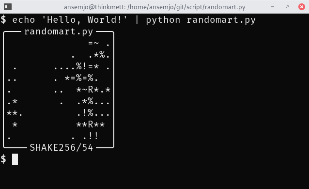

# randomart.py

A script to present SHAKE256 hashes as small ASCII-art pictures, similarly to OpenSSH's
[randomart](https://superuser.com/q/22535).

This allows easier verification by humans but may not be as secure as a bytewise comparison of the
digest! Pass `--hash` to output both.

