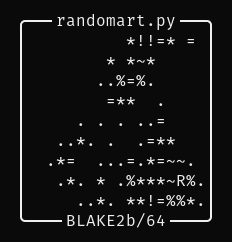

# randomart.py

[](https://www.codefactor.io/repository/github/ansemjo/randomart)

A script to present BLAKE2b hashes as small ASCII-art pictures, similarly to OpenSSH's
[randomart](https://superuser.com/q/22535).

This allows easier verification by humans but may not be as secure as a bytewise comparison of the
digest!

<span style="display:block;text-align:center"></span>

See the paper [Hash Visualization: a New Technique to improve Real-World Security<sup>1</sup>][^1]
for more information on the concept of random art.

The paper [The drunken bishop: An analysis of the OpenSSH fingerprint visualization
algorithm<sup>2</sup>][^2] analyses the OpenSSH implementation in more detail.

It should be explicitly noted that my algorithm is _similar_ but not _identical_ to the "drunken
bishop" walk of the OpenSSH implementation. The implementation at hand:

- flips sides at the borders, which turns the field into a torus
- moves in all possible directions with distance 1, not only diagonally
- does not mark start (`S`) and end (`E`) and uses a different character palette

I have not performed any similar analysis[<sup>2</sup>][^2] but would expect my implementation to
perform no worse.

## installation

Install with pip directly from GitHub:

    pip install git+https://github.com/ansemjo/randomart

## usage

The script expects a file in the first positional argument or otherwise simply reads from standard
input. It is thus best suitable for usage in a pipe:

    echo 'Hello, World!' | randomart.py

There are two flags to control the output:

- `--ascii` use only ASCII characters for the box frame
- `--hash` - print the computed digest before the randomart picture

Otherwise use `randomart.py --help` for usage help.

### as a library

If you want to use your own hash you can import from `random_art.randomart`:

```python
from random_art.randomart import draw, drunkenwalk
...

# generate your hash digest
digest = ...

# generate randomart, HASHNAME must be 10 characters
art = draw(drunkenwalk(digest), HASHNAME)
print(art)
```

[^1]:

  http://www.ece.cmu.edu/~adrian/projects/validation/validation.pdf "Perrig A. and Song D., 1999,
  International Workshop on Cryptographic Techniques and E-Commerce (CrypTEC '99)"

[^2]:

  http://www.dirk-loss.de/sshvis/drunken_bishop.pdf "Dirk Loss, Tobias Limmer, Alexander von
  Gernler, 2009"
